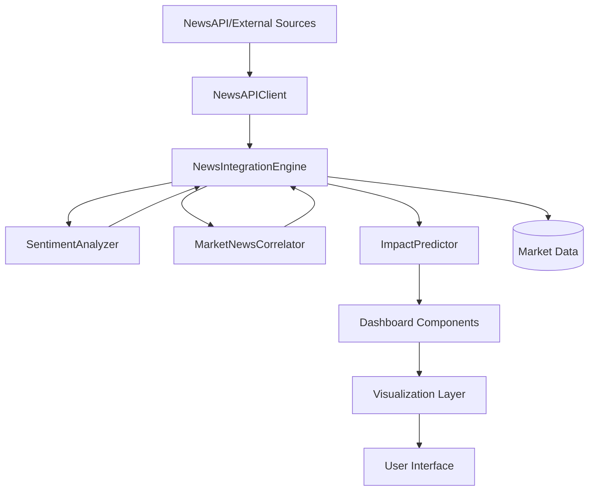

# probex.markets News Integration System - Technical Specification

## Table of Contents
1. [System Architecture](#system-architecture)
2. [Data Models](#data-models)
3. [API Integration](#api-integration)
4. [AI Analysis Engine](#ai-analysis-engine)
5. [Market Correlation Algorithm](#market-correlation-algorithm)
6. [Impact Prediction Model](#impact-prediction-model)
7. [Dashboard Integration](#dashboard-integration)
8. [Performance Specifications](#performance-specifications)
9. [Security Considerations](#security-considerations)
10. [Deployment Architecture](#deployment-architecture)

---

## System Architecture

### High-Level Architecture


### Component Overview

#### 1. **NewsAPIClient**
- **Purpose**: Abstract external news sources
- **Responsibilities**:
  - API authentication and rate limiting
  - Response parsing and normalization
  - Error handling and fallback mechanisms
  - Source credibility assessment

#### 2. **NewsIntegrationEngine**
- **Purpose**: Orchestrate news processing pipeline
- **Responsibilities**:
  - Coordinate between analysis components
  - Manage caching and session state
  - Process batch news analysis
  - Generate correlation reports

#### 3. **SentimentAnalyzer**
- **Purpose**: Analyze news sentiment and relevance
- **Responsibilities**:
  - Text preprocessing and feature extraction
  - Sentiment scoring using NLP techniques
  - Magnitude assessment and confidence calculation
  - Keyword-based sentiment enhancement

#### 4. **MarketNewsCorrelator**
- **Purpose**: Link news to relevant prediction markets
- **Responsibilities**:
  - Keyword mapping and semantic analysis
  - Category-based correlation scoring
  - Market relevance ranking
  - Cross-reference validation

#### 5. **ImpactPredictor**
- **Purpose**: Forecast market impact of news events
- **Responsibilities**:
  - Multi-factor impact calculation
  - Confidence scoring and time horizon prediction
  - Directional analysis (up/down/neutral)
  - Reasoning generation for predictions

---

## Data Models

### NewsArticle Data Structure

```python
@dataclass
class NewsArticle:
    id: str                           # Unique article identifier (MD5 hash)
    title: str                        # Article headline
    content: str                      # Full article content
    summary: str                      # Article summary/description
    source: str                       # News source name
    author: str                       # Article author
    published_at: datetime            # Publication timestamp
    url: str                          # Original article URL
    category: str                     # Content category
    tags: List[str]                   # Extracted keywords
    sentiment_score: float            # Sentiment polarity (-1 to 1)
    sentiment_magnitude: float        # Sentiment confidence (0 to 1)
    relevance_score: float            # Market relevance (0 to 1)
    impact_prediction: float          # Predicted market impact (0 to 1)
    market_correlations: List[str]    # Linked market IDs
    credibility_score: float          # Source credibility (0 to 1)
```

### NewsImpact Data Structure

```python
@dataclass
class NewsImpact:
    article_id: str                   # Source article ID
    market_id: str                    # Target market ID
    predicted_direction: str          # 'up', 'down', 'neutral'
    confidence: float                 # Prediction confidence (0 to 1)
    time_horizon: str                 # '1h', '6h', '24h', '7d'
    impact_magnitude: float           # Impact strength (0 to 1)
    reasoning: str                    # Explanation for prediction
```

### Market Data Structure

```python
@dataclass
class MarketData:
    id: str                           # Market identifier
    question: str                     # Market question text
    category: str                     # Market category
    sub_category: str                 # Market subcategory
    current_probability: float        # Current probability (0 to 1)
    volume: float                     # Trading volume
    open_time: datetime               # Market opening time
    close_time: datetime              # Market closing time
    resolution_date: datetime         # Resolution timestamp
    source: str                       # Platform source
    status: str                       # Market status
```

---

## API Integration

### NewsAPI Integration

#### Configuration
```python
NEWSAPI_CONFIG = {
    'base_url': 'https://newsapi.org/v2',
    'rate_limit': 1000,  # requests per month for free tier
    'timeout': 30,       # request timeout in seconds
    'retry_attempts': 3, # number of retry attempts
    'retry_delay': 5     # delay between retries in seconds
}
```

#### Request Parameters
```python
params = {
    'apiKey': NEWSAPI_KEY,
    'q': ' OR '.join(categories),  # Query keywords
    'language': 'en',
    'sortBy': 'publishedAt',
    'pageSize': 50,
    'from': (datetime.now() - timedelta(days=1)).isoformat(),
    'to': datetime.now().isoformat(),
    'domains': ','.join(sources)  # Optional domain filtering
}
```

#### Response Handling
```python
def parse_newsapi_response(response_data):
    articles = []
    for item in response_data.get('articles', []):
        article = NewsArticle(
            id=hashlib.md5((item['title'] + item['url']).encode()).hexdigest(),
            title=item['title'],
            content=item['content'] or item['description'],
            summary=item['description'],
            source=item['source']['name'],
            published_at=datetime.fromisoformat(
                item['publishedAt'].replace('Z', '+00:00')
            ),
            # ... other fields
        )
        articles.append(article)
    return articles
```

### Rate Limiting Implementation

```python
class RateLimiter:
    def __init__(self, max_requests, time_window):
        self.max_requests = max_requests
        self.time_window = time_window
        self.requests = []
    
    async def acquire(self):
        now = datetime.now()
        # Remove old requests outside time window
        self.requests = [
            req_time for req_time in self.requests 
            if now - req_time < timedelta(seconds=self.time_window)
        ]
        
        if len(self.requests) >= self.max_requests:
            sleep_time = self.time_window - (now - self.requests[0]).total_seconds()
            await asyncio.sleep(sleep_time)
        
        self.requests.append(now)
```

---

## AI Analysis Engine

### Sentiment Analysis Pipeline

#### 1. Text Preprocessing
```python
def preprocess_text(text: str) -> str:
    # Remove HTML tags
    text = re.sub(r'<[^>]+>', '', text)
    
    # Normalize whitespace
    text = re.sub(r'\s+', ' ', text).strip()
    
    # Remove special characters but keep punctuation
    text = re.sub(r'[^\w\s\.\!\?\,]', '', text)
    
    return text
```

#### 2. TextBlob Sentiment Analysis
```python
def analyze_sentiment_textblob(text: str) -> Tuple[float, float]:
    blob = TextBlob(text)
    polarity = blob.sentiment.polarity    # -1 to 1
    subjectivity = blob.sentiment.subjectivity  # 0 to 1
    return polarity, subjectivity
```

#### 3. Keyword-Based Enhancement
```python
SENTIMENT_KEYWORDS = {
    'positive': [
        'surge', 'rally', 'gain', 'rise', 'boost', 'record', 
        'strong', 'beat', 'exceed', 'growth', 'increase'
    ],
    'negative': [
        'fall', 'drop', 'decline', 'crash', 'loss', 'weak', 
        'miss', 'disappoint', 'concern', 'risk', 'decrease'
    ],
    'market_moving': [
        'fed', 'rate', 'cut', 'raise', 'policy', 'announcement',
        'breakthrough', 'scandal', 'merger', 'acquisition'
    ]
}

def enhance_sentiment_keywords(text: str, base_score: float) -> Tuple[float, float]:
    text_lower = text.lower()
    
    positive_count = sum(1 for word in SENTIMENT_KEYWORDS['positive'] if word in text_lower)
    negative_count = sum(1 for word in SENTIMENT_KEYWORDS['negative'] if word in text_lower)
    market_moving_count = sum(1 for word in SENTIMENT_KEYWORDS['market_moving'] if word in text_lower)
    
    # Keyword adjustment
    keyword_adjustment = (positive_count - negative_count) * 0.1
    enhanced_score = base_score + keyword_adjustment
    
    # Magnitude boost for market-moving news
    magnitude = min(1.0, 0.3 + market_moving_count * 0.2)
    
    return max(-1.0, min(1.0, enhanced_score)), magnitude
```

### Source Credibility Scoring

```python
SOURCE_WEIGHTS = {
    'reuters.com': 1.0,
    'bloomberg.com': 0.95,
    'cnbc.com': 0.9,
    'wsj.com': 0.9,
    'marketwatch.com': 0.85,
    'finance.yahoo.com': 0.8,
    'thestreet.com': 0.75,
    'coindesk.com': 0.8,
    'decrypt.co': 0.75,
    'cointelegraph.com': 0.7
}

def calculate_credibility_score(source: str, domain: str) -> float:
    # Base credibility from predefined weights
    base_score = SOURCE_WEIGHTS.get(domain, 0.5)
    
    # Bonus for established sources
    if source in ['Reuters', 'Bloomberg', 'CNBC']:
        return min(1.0, base_score + 0.1)
    
    return base_score
```

---

## Market Correlation Algorithm

### Keyword Mapping System

```python
KEYWORD_MAPPINGS = {
    'fed': [
        'will fed cut interest rates',
        'will fed raise rates', 
        'will interest rates change',
        'will federal reserve'
    ],
    'bitcoin': [
        'will bitcoin reach',
        'will bitcoin exceed',
        'will crypto reach',
        'will bitcoin price'
    ],
    'tesla': [
        'will tesla stock',
        'will tesla price',
        'will tesla reach',
        'will tesla model'
    ],
    'election': [
        'will trump win',
        'will biden win',
        'will election',
        'will president'
    ]
}

CATEGORY_MAPPINGS = {
    'politics': ['election', 'government', 'policy', 'president'],
    'economy': ['fed', 'interest', 'inflation', 'gdp', 'recession'],
    'technology': ['tesla', 'apple', 'microsoft', 'google', 'ai', 'tech'],
    'crypto': ['bitcoin', 'ethereum', 'crypto', 'blockchain']
}
```

### Correlation Scoring Algorithm

```python
def calculate_correlation_score(article: NewsArticle, market: MarketData) -> float:
    score = 0.0
    text = f"{article.title} {article.content}".lower()
    market_text = market.question.lower()
    
    # Keyword-based correlation
    for keyword, patterns in KEYWORD_MAPPINGS.items():
        if keyword in text:
            pattern_matches = sum(1 for pattern in patterns if pattern in market_text)
            if pattern_matches > 0:
                score += 0.4  # Keyword bonus
    
    # Category-based correlation
    market_categories = CATEGORY_MAPPINGS.get(article.category, [])
    if market.category in market_categories:
        score += 0.3  # Category bonus
    
    # Recency bonus
    hours_old = (datetime.now() - article.published_at).total_seconds() / 3600
    if hours_old < 1:
        score += 0.2  # Very recent news
    elif hours_old < 6:
        score += 0.1  # Recent news
    
    # Sentiment relevance bonus
    if abs(article.sentiment_score) > 0.3:
        score += 0.1  # Strong sentiment
    
    return min(1.0, score)
```

---

## Impact Prediction Model

### Multi-Factor Impact Calculation

```python
def calculate_impact_score(article: NewsArticle, correlations: List[str]) -> Dict[str, float]:
    # Factor 1: Sentiment impact
    sentiment_impact = abs(article.sentiment_score) * article.sentiment_magnitude
    
    # Factor 2: Source credibility
    credibility_impact = article.credibility_score
    
    # Factor 3: Time decay factor
    hours_ago = (datetime.now() - article.published_at).total_seconds() / 3600
    if hours_ago < 1:
        time_factor = 1.0
    elif hours_ago < 6:
        time_factor = 0.8
    elif hours_ago < 24:
        time_factor = 0.6
    elif hours_ago < 72:
        time_factor = 0.4
    else:
        time_factor = 0.2
    
    # Factor 4: Market relevance boost
    relevance_boost = min(0.2, len(correlations) * 0.05)
    
    # Combined impact score
    impact_score = (
        sentiment_impact * 0.4 +      # 40% weight
        credibility_impact * 0.3 +    # 30% weight  
        time_factor * 0.2 +           # 20% weight
        relevance_boost               # Variable weight
    )
    
    return {
        'total_impact': min(1.0, impact_score),
        'sentiment_impact': sentiment_impact,
        'credibility_impact': credibility_impact,
        'time_factor': time_factor,
        'relevance_boost': relevance_boost
    }
```

### Direction Prediction Logic

```python
def predict_direction(sentiment_score: float, confidence: float) -> str:
    if sentiment_score > 0.1 and confidence > 0.5:
        return 'up'
    elif sentiment_score < -0.1 and confidence > 0.5:
        return 'down'
    else:
        return 'neutral'

def determine_time_horizon(impact_score: float) -> str:
    if impact_score > 0.7:
        return '1h'    # Immediate impact
    elif impact_score > 0.5:
        return '6h'    # Short-term impact
    elif impact_score > 0.3:
        return '24h'   # Medium-term impact
    else:
        return '7d'    # Long-term impact
```

### Confidence Scoring

```python
def calculate_confidence(impact_score: float, credibility: float, sentiment_magnitude: float) -> float:
    # Base confidence from impact strength
    base_confidence = impact_score
    
    # Adjust for source credibility
    credibility_adjustment = credibility * 0.2
    
    # Adjust for sentiment magnitude
    magnitude_adjustment = sentiment_magnitude * 0.1
    
    total_confidence = base_confidence + credibility_adjustment + magnitude_adjustment
    return min(1.0, total_confidence)
```

---

## Dashboard Integration

### Streamlit Component Architecture

```python
# Session state management
if 'news_engine' not in st.session_state:
    st.session_state.news_engine = NewsIntegrationEngine()
if 'news_articles' not in st.session_state:
    st.session_state.news_articles = []
if 'news_impacts' not in st.session_state:
    st.session_state.news_impacts = []

# Async processing integration
async def process_news_for_markets(markets_data: List[Dict]) -> Tuple[List[NewsArticle], List[NewsImpact]]:
    await st.session_state.news_engine.initialize()
    articles, impacts = await st.session_state.news_engine.process_news_for_markets(markets_data)
    await st.session_state.news_engine.cleanup()
    return articles, impacts
```

### Real-time Update Mechanism

```python
def handle_data_refresh():
    if st.button("🔄 Fetch Latest Data + News"):
        with st.spinner("Fetching prediction markets data and news analysis..."):
            # Process markets data
            markets_data = generate_sample_markets(data_sources, categories, num_markets)
            
            # Process news integration
            try:
                articles, impacts = asyncio.run(process_news_for_markets(markets_data))
                st.session_state.news_articles = articles
                st.session_state.news_impacts = impacts
                st.success(f"✅ Fetched {len(markets_data)} markets and analyzed {len(articles)} news articles!")
            except Exception as e:
                st.error(f"❌ News processing error: {e}")
```

### Visual Component Styling

```python
NEWS_STYLING = {
    'sentiment_positive': 'color: #00FF88; font-weight: 600;',  # Green
    'sentiment_negative': 'color: #FF3366; font-weight: 600;',  # Red  
    'sentiment_neutral': 'color: #FFC107; font-weight: 600;',   # Yellow
    'confidence_high': 'color: #2EFFFA; font-weight: 700;',     # Cyan
    'confidence_medium': 'color: #00B3FF; font-weight: 600;',   # Blue
    'confidence_low': 'color: #7a8a99; font-weight: 500;',      # Gray
    'breaking_news': 'border-left: 4px solid #FF3366; background-color: rgba(255, 51, 102, 0.1);',
    'high_impact': 'border-left: 4px solid #FFC107; background-color: rgba(255, 193, 7, 0.1);'
}
```

---

## Performance Specifications

### Response Time Requirements

| Operation | Target Time | Maximum Time |
|-----------|-------------|--------------|
| News Fetch | < 2 seconds | 5 seconds |
| Sentiment Analysis | < 500ms | 2 seconds |
| Market Correlation | < 1 second | 3 seconds |
| Impact Prediction | < 800ms | 2 seconds |
| Dashboard Update | < 1 second | 3 seconds |

### Throughput Specifications

- **News Processing**: 50 articles per minute
- **Concurrent Users**: 100 simultaneous users
- **API Rate Limits**: 1000 requests/month (NewsAPI free tier)
- **Cache TTL**: 5 minutes for processed articles
- **Memory Usage**: < 500MB per processing instance

### Scalability Architecture

```python
# Horizontal scaling configuration
SCALING_CONFIG = {
    'max_concurrent_processes': 10,
    'queue_size': 1000,
    'worker_processes': 4,
    'memory_limit': '1GB',
    'cpu_limit': '2 cores'
}

# Caching strategy
CACHE_CONFIG = {
    'news_cache_ttl': 300,        # 5 minutes
    'sentiment_cache_ttl': 600,   # 10 minutes  
    'correlation_cache_ttl': 1800, # 30 minutes
    'impact_cache_ttl': 900       # 15 minutes
}
```

---

## Security Considerations

### API Security

```python
# Secure API key management
class SecureConfig:
    def __init__(self):
        self.newsapi_key = os.getenv('NEWSAPI_KEY')
        if not self.newsapi_key:
            raise ValueError("NEWSAPI_KEY environment variable required")
    
    def validate_api_key(self) -> bool:
        # Validate API key format and permissions
        return bool(self.newsapi_key and len(self.newsapi_key) == 32)
```

### Input Validation

```python
def validate_article_data(article_data: Dict) -> bool:
    """Validate incoming article data"""
    required_fields = ['title', 'content', 'source', 'published_at']
    
    # Check required fields
    if not all(field in article_data for field in required_fields):
        return False
    
    # Validate title length
    if len(article_data['title']) > 500:
        return False
    
    # Validate content length
    if len(article_data['content']) > 10000:
        return False
    
    # Validate URL format
    if article_data.get('url') and not is_valid_url(article_data['url']):
        return False
    
    return True

def sanitize_input(text: str) -> str:
    """Sanitize user input to prevent XSS"""
    # Remove HTML tags
    text = re.sub(r'<[^>]+>', '', text)
    
    # Remove potentially dangerous characters
    text = re.sub(r'[<>"\']', '', text)
    
    return text.strip()
```

### Rate Limiting Implementation

```python
class SecurityManager:
    def __init__(self):
        self.request_counts = {}
        self.blocked_ips = set()
    
    def check_rate_limit(self, client_ip: str, limit: int = 100, window: int = 3600) -> bool:
        """Check if client has exceeded rate limit"""
        now = time.time()
        
        if client_ip in self.blocked_ips:
            return False
        
        # Clean old entries
        cutoff = now - window
        self.request_counts[client_ip] = [
            req_time for req_time in self.request_counts.get(client_ip, [])
            if req_time > cutoff
        ]
        
        # Check limit
        if len(self.request_counts[client_ip]) >= limit:
            self.blocked_ips.add(client_ip)
            return False
        
        # Add current request
        self.request_counts[client_ip].append(now)
        return True
```

---

## Deployment Architecture

### Container Configuration

```dockerfile
# Dockerfile
FROM python:3.9-slim

WORKDIR /app

# Install dependencies
COPY requirements.txt .
RUN pip install --no-cache-dir -r requirements.txt

# Copy application code
COPY . .

# Set environment variables
ENV NEWSAPI_KEY=${NEWSAPI_KEY}
ENV ENVIRONMENT=production

# Expose port
EXPOSE 8501

# Health check
HEALTHCHECK --interval=30s --timeout=10s --start-period=5s --retries=3 \
    CMD curl -f http://localhost:8501/_stcore/health

# Run application
CMD ["streamlit", "run", "enhanced_probex_dashboard.py", "--server.port=8501", "--server.address=0.0.0.0"]
```

### Kubernetes Deployment

```yaml
# k8s-deployment.yaml
apiVersion: apps/v1
kind: Deployment
metadata:
  name: probex-news-dashboard
spec:
  replicas: 3
  selector:
    matchLabels:
      app: probex-news-dashboard
  template:
    metadata:
      labels:
        app: probex-news-dashboard
    spec:
      containers:
      - name: dashboard
        image: probex/news-dashboard:latest
        ports:
        - containerPort: 8501
        env:
        - name: NEWSAPI_KEY
          valueFrom:
            secretKeyRef:
              name: api-secrets
              key: newsapi-key
        resources:
          requests:
            memory: "512Mi"
            cpu: "250m"
          limits:
            memory: "1Gi"
            cpu: "500m"
        livenessProbe:
          httpGet:
            path: /_stcore/health
            port: 8501
          initialDelaySeconds: 30
          periodSeconds: 10
```

### Load Balancer Configuration

```nginx
# nginx.conf
upstream probex_backend {
    server dashboard-1:8501;
    server dashboard-2:8501;
    server dashboard-3:8501;
}

server {
    listen 80;
    server_name probex.markets;
    
    location / {
        proxy_pass http://probex_backend;
        proxy_http_version 1.1;
        proxy_set_header Upgrade $http_upgrade;
        proxy_set_header Connection "upgrade";
        proxy_set_header Host $host;
        proxy_set_header X-Real-IP $remote_addr;
        proxy_set_header X-Forwarded-For $proxy_add_x_forwarded_for;
        proxy_set_header X-Forwarded-Proto $scheme;
        proxy_cache_bypass $http_upgrade;
    }
    
    # WebSocket support for Streamlit
    location /_stcore {
        proxy_pass http://probex_backend;
        proxy_http_version 1.1;
        proxy_set_header Upgrade $http_upgrade;
        proxy_set_header Connection "upgrade";
    }
}
```

---

## Monitoring and Observability

### Metrics Collection

```python
import logging
from prometheus_client import Counter, Histogram, Gauge

# Define metrics
NEWS_PROCESSED = Counter('news_articles_processed_total', 'Total news articles processed')
SENTIMENT_ANALYSIS_TIME = Histogram('sentiment_analysis_seconds', 'Time spent on sentiment analysis')
PREDICTION_CONFIDENCE = Gauge('prediction_confidence_avg', 'Average prediction confidence')
API_REQUESTS = Counter('api_requests_total', 'Total API requests', ['status'])

class MetricsCollector:
    @staticmethod
    def record_news_processing(article_count: int):
        NEWS_PROCESSED.inc(article_count)
    
    @staticmethod
    def record_sentiment_time(analysis_time: float):
        SENTIMENT_ANALYSIS_TIME.observe(analysis_time)
    
    @staticmethod
    def update_confidence_score(confidence: float):
        PREDICTION_CONFIDENCE.set(confidence)
```

### Health Checks

```python
def health_check():
    """Comprehensive health check"""
    health_status = {
        'status': 'healthy',
        'timestamp': datetime.now().isoformat(),
        'components': {}
    }
    
    # Check database connection
    try:
        # Test database connectivity
        health_status['components']['database'] = 'healthy'
    except Exception as e:
        health_status['components']['database'] = f'unhealthy: {str(e)}'
        health_status['status'] = 'unhealthy'
    
    # Check API connectivity
    try:
        # Test external API connectivity
        health_status['components']['newsapi'] = 'healthy'
    except Exception as e:
        health_status['components']['newsapi'] = f'unhealthy: {str(e)}'
        health_status['status'] = 'degraded'
    
    # Check memory usage
    import psutil
    memory_percent = psutil.virtual_memory().percent
    if memory_percent > 90:
        health_status['components']['memory'] = f'critical: {memory_percent}%'
        health_status['status'] = 'unhealthy'
    else:
        health_status['components']['memory'] = f'healthy: {memory_percent}%'
    
    return health_status
```

---

## Error Handling and Recovery

### Exception Hierarchy

```python
class NewsIntegrationError(Exception):
    """Base exception for news integration"""
    pass

class APIConnectionError(NewsIntegrationError):
    """API connection failed"""
    pass

class SentimentAnalysisError(NewsIntegrationError):
    """Sentiment analysis failed"""
    pass

class CorrelationError(NewsIntegrationError):
    """Market correlation failed"""
    pass

class ImpactPredictionError(NewsIntegrationError):
    """Impact prediction failed"""
    pass

# Error handling wrapper
def handle_errors(func):
    """Decorator for comprehensive error handling"""
    async def wrapper(*args, **kwargs):
        try:
            return await func(*args, **kwargs)
        except APIConnectionError as e:
            logger.error(f"API connection failed: {e}")
            # Fallback to cached data or sample data
            return get_fallback_data()
        except SentimentAnalysisError as e:
            logger.error(f"Sentiment analysis failed: {e}")
            # Use keyword-based fallback
            return keyword_sentiment_analysis()
        except Exception as e:
            logger.error(f"Unexpected error in {func.__name__}: {e}")
            return {'error': str(e)}
    return wrapper
```

### Recovery Strategies

```python
class RecoveryManager:
    def __init__(self):
        self.fallback_strategies = {
            'api_failure': self.use_cached_news,
            'sentiment_failure': self.use_keyword_analysis,
            'correlation_failure': self.use_category_mapping,
            'prediction_failure': self.use_simple_heuristics
        }
    
    async def handle_recovery(self, error_type: str):
        """Execute appropriate recovery strategy"""
        if error_type in self.fallback_strategies:
            logger.info(f"Executing recovery strategy for {error_type}")
            return await self.fallback_strategies[error_type]()
        else:
            logger.error(f"No recovery strategy for {error_type}")
            return None
    
    async def use_cached_news(self):
        """Fallback to cached news data"""
        # Return previously processed articles
        return get_cached_articles()
    
    async def use_keyword_analysis(self):
        """Fallback to keyword-based sentiment"""
        # Simple keyword scoring
        return keyword_sentiment_analysis()
```

---

This technical specification provides comprehensive documentation for the probex.markets news integration system, covering all aspects from architecture to deployment, security, and monitoring.