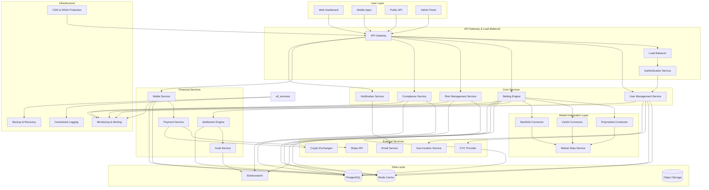
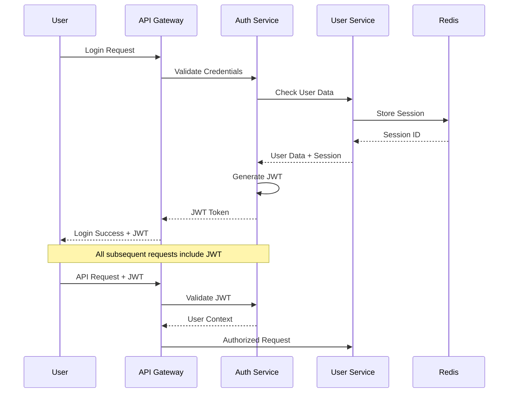
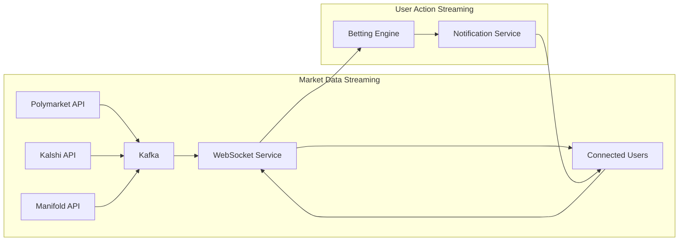

# MarketPulse Pro Betting Platform - System Architecture

## Overview

This document outlines the system architecture for the MarketPulse Pro betting platform, designed to integrate with prediction markets (Polymarket, Kalshi, Manifold) while maintaining compliance with US regulations and providing a secure, scalable user experience.

## Architecture Principles

1. **Security First**: All components designed with security and compliance as primary requirements
2. **Microservices**: Modular architecture for scalability and independent deployment
3. **Event-Driven**: Real-time market data and user interactions handled via events
4. **API-First**: All functionality exposed through well-defined APIs
5. **Compliance-Ready**: Built-in monitoring, auditing, and regulatory reporting
6. **Scalable**: Designed to handle 10,000+ concurrent users and 1,000+ transactions/second

## High-Level Architecture



## Core Service Architecture

### 1. User Management Service

**Purpose**: Handle user accounts, authentication, and profile management

**Key Components**:
- User registration and email verification
- OAuth 2.0 + JWT authentication
- Two-factor authentication (2FA)
- Password management and reset
- User preferences and settings
- Session management

**Technology Stack**:
- FastAPI with Python
- Auth0 for OAuth and user management
- Redis for session storage
- PostgreSQL for user data

**Security Features**:
- Multi-factor authentication
- Rate limiting on authentication endpoints
- IP-based security rules
- Suspicious activity detection

### 2. Betting Engine

**Purpose**: Core betting functionality and order management

**Key Components**:
- Order placement and management
- Position tracking and P&L calculation
- Market data integration and caching
- Real-time price updates via WebSockets
- Order matching and execution
- Settlement processing

**Technology Stack**:
- FastAPI with Python
- WebSockets for real-time communication
- PostgreSQL for transactional data
- Redis for market data caching
- Celery for background tasks

**Performance Requirements**:
- Support 1,000+ orders per second
- <100ms order placement latency
- 99.9% uptime availability
- Real-time market data updates

### 3. Risk Management Service

**Purpose**: Monitor and control betting risks

**Key Components**:
- Position sizing using Kelly Criterion
- Risk limit enforcement
- Portfolio-level risk monitoring
- Market impact analysis
- Stop-loss and take-profit automation
- Correlation analysis across markets

**Technology Stack**:
- Python with NumPy/Pandas for calculations
- Machine learning models for risk assessment
- PostgreSQL for historical risk data
- Real-time risk monitoring

**Risk Controls**:
- Maximum position size limits
- Daily/weekly loss limits
- Concentration limits by category
- Blacklist for prohibited markets
- Automated risk alerts

### 4. Compliance Service

**Purpose**: Ensure regulatory compliance and monitoring

**Key Components**:
- KYC/AML document verification
- Geo-location and jurisdiction checking
- VPN detection and blocking
- Age verification (18+ requirement)
- Transaction monitoring and reporting
- Regulatory audit trail

**Technology Stack**:
- FastAPI with Python
- Third-party KYC integration
- Geo-location APIs
- Elasticsearch for compliance reporting
- Automated reporting systems

**Compliance Features**:
- Real-time jurisdiction validation
- Automated suspicious activity reporting
- Comprehensive audit logging
- Regulatory report generation
- Privacy compliance (GDPR/CCPA)

### 5. Market Data Service

**Purpose**: Aggregate and distribute market data from prediction markets

**Key Components**:
- API connectors for Polymarket, Kalshi, Manifold
- Data normalization and validation
- Real-time data streaming
- Historical data storage
- Data quality monitoring

**Technology Stack**:
- Python with asyncio for API integration
- WebSockets for real-time streaming
- PostgreSQL for market data
- Redis for data caching
- Apache Kafka for data streaming

**Data Features**:
- Sub-second latency for market updates
- 99.9% data availability
- Historical data going back 1 year
- Data validation and quality checks
- Fallback data sources

### 6. Wallet Service

**Purpose**: Manage user funds and transactions

**Key Components**:
- Multi-currency wallet support (USD, USDC, crypto)
- Balance management and tracking
- Deposit and withdrawal processing
- Transaction history and reporting
- Fraud detection and prevention

**Technology Stack**:
- FastAPI with Python
- PostgreSQL for financial data
- Stripe for credit card processing
- Coinbase Commerce for crypto
- Cold storage for cryptocurrency

**Security Features**:
- Multi-signature wallets for crypto
- Cold storage for large balances
- Real-time fraud detection
- Transaction monitoring
- Secure API key management

## Database Architecture

### PostgreSQL (Primary Database)

**Schema Design**:

```sql
-- Users table
CREATE TABLE users (
    id UUID PRIMARY KEY DEFAULT gen_random_uuid(),
    email VARCHAR(255) UNIQUE NOT NULL,
    username VARCHAR(50) UNIQUE,
    hashed_password VARCHAR(255) NOT NULL,
    email_verified BOOLEAN DEFAULT FALSE,
    two_factor_enabled BOOLEAN DEFAULT FALSE,
    kyc_status VARCHAR(20) DEFAULT 'pending',
    jurisdiction VARCHAR(10),
    risk_rating VARCHAR(10),
    created_at TIMESTAMP DEFAULT NOW(),
    updated_at TIMESTAMP DEFAULT NOW()
);

-- Bets table
CREATE TABLE bets (
    id UUID PRIMARY KEY DEFAULT gen_random_uuid(),
    user_id UUID REFERENCES users(id),
    platform VARCHAR(20) NOT NULL, -- 'polymarket', 'kalshi', 'manifold'
    market_id VARCHAR(100) NOT NULL,
    outcome VARCHAR(50) NOT NULL,
    amount DECIMAL(12,2) NOT NULL,
    price DECIMAL(6,4) NOT NULL,
    quantity INTEGER NOT NULL,
    status VARCHAR(20) DEFAULT 'pending',
    placed_at TIMESTAMP DEFAULT NOW(),
    settled_at TIMESTAMP,
    pnl DECIMAL(12,2) DEFAULT 0
);

-- Transactions table
CREATE TABLE transactions (
    id UUID PRIMARY KEY DEFAULT gen_random_uuid(),
    user_id UUID REFERENCES users(id),
    type VARCHAR(20) NOT NULL, -- 'deposit', 'withdrawal', 'bet', 'payout'
    amount DECIMAL(12,2) NOT NULL,
    currency VARCHAR(10) NOT NULL,
    status VARCHAR(20) DEFAULT 'pending',
    external_id VARCHAR(100),
    created_at TIMESTAMP DEFAULT NOW(),
    completed_at TIMESTAMP
);

-- Compliance logs table
CREATE TABLE compliance_logs (
    id UUID PRIMARY KEY DEFAULT gen_random_uuid(),
    user_id UUID REFERENCES users(id),
    event_type VARCHAR(50) NOT NULL,
    details JSONB,
    ip_address INET,
    user_agent TEXT,
    created_at TIMESTAMP DEFAULT NOW()
);
```

### Redis (Caching & Sessions)

**Cache Strategy**:
- User sessions and authentication tokens
- Real-time market data and prices
- Market metadata and configuration
- Rate limiting counters
- Temporary betting locks

**Session Management**:
- JWT token blacklist
- User session tracking
- API rate limiting counters
- WebSocket connection management

### Elasticsearch (Search & Analytics)

**Use Cases**:
- Full-text search for markets and questions
- Compliance reporting and audit searches
- Analytics and business intelligence
- Log aggregation and searching
- Market correlation analysis

## Security Architecture

### Authentication & Authorization



### Data Encryption

**Encryption Strategy**:
- **At Rest**: AES-256 encryption for sensitive data
- **In Transit**: TLS 1.3 for all communications
- **Database**: Transparent Data Encryption (TDE)
- **API Keys**: HashiCorp Vault for secrets management
- **User Passwords**: bcrypt hashing with salt

**Key Management**:
- AWS KMS for encryption key management
- Regular key rotation (90-day cycle)
- Multi-factor access to encryption keys
- Audit trail for all key operations

### Network Security

**Network Architecture**:
- VPC with private subnets for application servers
- Public subnets for load balancers and NAT gateways
- Security groups with principle of least privilege
- WAF (Web Application Firewall) for DDoS protection
- CDN with DDoS mitigation

**Access Controls**:
- VPN access for administrative functions
- IP whitelisting for database access
- Multi-factor authentication for all admin access
- Regular security assessments and penetration testing

## Real-Time Architecture

### WebSocket Connections



### Event-Driven Architecture

**Event Types**:
- Market data updates
- Order placement/confirmation
- Settlement events
- User action events
- Compliance events

**Event Flow**:
1. External APIs generate events
2. Events processed by Kafka streams
3. Services consume relevant events
4. Actions triggered based on events
5. Notifications sent to users

## Monitoring & Observability

### Application Monitoring

**Metrics Collection**:
- Request latency and throughput
- Error rates and types
- Database performance
- Cache hit rates
- Real-time user metrics

**Alerting Strategy**:
- Critical alerts for service outages
- Warning alerts for performance degradation
- Compliance alerts for unusual activity
- Security alerts for suspicious patterns

### Logging Architecture

**Log Types**:
- Application logs (structured JSON)
- Access logs (HTTP requests/responses)
- Audit logs (user actions)
- Security logs (authentication, authorization)
- Compliance logs (regulatory events)

**Log Management**:
- Centralized logging with ELK stack
- Log retention policies (7 years for compliance)
- Log analysis and alerting
- Privacy-compliant log processing

## Deployment Architecture

### Container Orchestration

**Kubernetes Deployment**:
```yaml
apiVersion: apps/v1
kind: Deployment
metadata:
  name: betting-engine
spec:
  replicas: 3
  selector:
    matchLabels:
      app: betting-engine
  template:
    metadata:
      labels:
        app: betting-engine
    spec:
      containers:
      - name: betting-engine
        image: marketpulse/betting-engine:latest
        ports:
        - containerPort: 8000
        env:
        - name: DATABASE_URL
          valueFrom:
            secretKeyRef:
              name: db-secret
              key: url
        resources:
          requests:
            memory: "256Mi"
            cpu: "250m"
          limits:
            memory: "512Mi"
            cpu: "500m"
```

### CI/CD Pipeline

**Deployment Process**:
1. Code commit triggers CI pipeline
2. Automated testing and security scans
3. Container image build and push
4. Staging environment deployment
5. Automated testing in staging
6. Production deployment (blue-green)
7. Health checks and monitoring

### Infrastructure as Code

**Terraform Configuration**:
```hcl
resource "aws_eks_cluster" "marketpulse" {
  name     = "marketpulse-cluster"
  role_arn = aws_iam_role.eks_cluster_role.arn
  version  = "1.27"
  
  vpc_config {
    subnet_ids = [
      aws_subnet.private_subnet_1.id,
      aws_subnet.private_subnet_2.id,
      aws_subnet.public_subnet_1.id,
      aws_subnet.public_subnet_2.id,
    ]
    endpoint_private_access = true
    endpoint_public_access  = true
  }
}
```

## Scalability Strategy

### Horizontal Scaling

**Auto-scaling Triggers**:
- CPU utilization > 70%
- Memory utilization > 80%
- Request queue length > 100
- Response time > 500ms
- Concurrent connections > 1000

**Scaling Policies**:
- Scale up: Add 2 instances when trigger hit
- Scale down: Remove 1 instance after 10 minutes
- Maximum instances: 20 per service
- Minimum instances: 2 per service (high availability)

### Database Scaling

**Read Replicas**:
- 3 read replicas for each database
- Automatic failover for high availability
- Read/write splitting for queries
- Connection pooling and load balancing

**Sharding Strategy**:
- Shard by user ID for bet data
- Shard by date for historical data
- Automatic rebalancing based on load
- Cross-shard queries minimized

## Disaster Recovery

### Backup Strategy

**Database Backups**:
- Point-in-time recovery enabled
- Daily full backups
- Hourly incremental backups
- Cross-region backup replication
- 7-year retention for compliance

**Application Backups**:
- Infrastructure as Code (IaC) for reproducibility
- Container images stored in multiple registries
- Configuration management in version control
- Environment-specific configurations

### Recovery Procedures

**RTO/RPO Targets**:
- Recovery Time Objective (RTO): 4 hours
- Recovery Point Objective (RPO): 15 minutes
- Business continuity: 99.9% availability

**Failover Process**:
1. Automated health checks detect issues
2. Load balancer redirects traffic
3. Database failover to secondary region
4. Service restart on healthy instances
5. Monitoring and alerting throughout process

## Compliance Framework

### Regulatory Requirements

**US Betting Compliance**:
- Age verification (18+ requirement)
- Jurisdiction-based access control
- KYC/AML documentation requirements
- Transaction reporting and monitoring
- Responsible gambling features

**Data Protection Compliance**:
- GDPR compliance for EU users
- CCPA compliance for California users
- Data minimization and retention policies
- User consent management
- Right to deletion implementation

### Audit Trail

**Comprehensive Logging**:
- All user actions logged with timestamps
- All financial transactions recorded
- All administrative actions tracked
- All compliance events documented
- All system changes auditable

**Retention Policies**:
- Transaction logs: 7 years
- User activity logs: 3 years
- Compliance logs: 7 years
- System logs: 1 year
- Audit logs: Permanent

## Performance Requirements

### Service Level Objectives (SLOs)

**Availability Targets**:
- User-facing services: 99.9% uptime
- Market data services: 99.95% uptime
- Payment services: 99.99% uptime
- Database services: 99.99% uptime

**Performance Targets**:
- API response time: <200ms (95th percentile)
- Order placement: <100ms (95th percentile)
- Market data latency: <500ms
- Page load time: <2 seconds
- Database query time: <50ms (95th percentile)

### Capacity Planning

**User Capacity**:
- 10,000 concurrent users
- 100,000 daily active users
- 1,000,000 monthly active users
- 10,000 new registrations per day

**Transaction Capacity**:
- 1,000 bets per second
- 10,000 transactions per second
- 100,000 market updates per second
- 1TB daily data processing

This architecture provides a robust, scalable, and compliant foundation for the MarketPulse Pro betting platform, designed to handle significant growth while maintaining security and regulatory compliance.